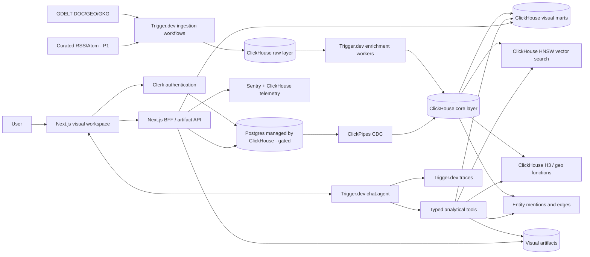

# 05 — Architecture

**Status:** Canonical technical specification, synthesized from the Deep Research corpus's `architecture.md` and `response-composer.md`, updated for the GDELT-primary and four-view-grammar resolutions in `01 Vision.md` §7.
**⚠ Scope notice:** this document describes the full multi-day/team-scale design. For the current ~15–20 hour implementation, `12 Scope Gate.md` is authoritative wherever the two conflict (fewer tools, three views not four, no Postgres/CDC, no vector retrieval) — read `12` and `10 Task Backlog.md` before implementing anything described here.
**Companion documents:** `06 Data.md`, `07 Tech Stack.md`, `09 Sprint Plan.md`, `10 Task Backlog.md`, `11 Risks.md`

---

## 1. Executive decision

Mirror is a **personalized impact-intelligence agent** that answers questions like *"What should I know today?"* with an interactive visual workspace rather than a textual answer. Production path:

1. GDELT (primary) and curated RSS (P1 supplement) are ingested continuously.
2. Trigger.dev orchestrates durable fetching, normalization, enrichment, embedding, aggregation, and chat turns.
3. ClickHouse is the primary database and retrieval engine for raw events, normalized articles, vector search, H3 geospatial analysis, entity relationships, personal-relevance scoring, provenance, product telemetry, and pre-aggregated visual marts.
4. `Trigger.dev chat.agent()` is the only conversational orchestrator. It routes the question to one of four response patterns (`03 UX.md` §3), selects a small set of typed analytical tools, queries ClickHouse through controlled templates, and streams a **Visual Response Manifest**.
5. The Next.js client renders coordinated Impact Radar / Timeline / Relationship Graph / Map views plus an Evidence Drawer. Text is limited to a verdict, labels, and concise explanations.

This directly implements the handbook's theme: the response itself is visual, interactive, and explorable; ClickHouse and Trigger.dev are core, not decorative.

---

## 2. Handbook constraints → architecture

| Constraint | Architectural consequence | Score effect |
|---|---|---|
| ClickHouse primary database | All analytical, retrieval, geospatial, vector, provenance, and telemetry workloads run in ClickHouse; Postgres is limited to a gated, four-table mutable-state surface | Maximizes the 25% stack criterion |
| `chat.agent()` mandatory | Every conversation is one durable `chat.agent()` run keyed by `chatId`; no substitute chat endpoint | Prevents disqualification, demonstrates depth |
| Meaningful use of both tools | ClickHouse performs visible live analyses; Trigger.dev runs the agent, ingestion, enrichment, schedules, retries, queues, streaming, recovery | 25% criterion visible in the demo |
| "Beyond the wall of text" | The agent returns a typed visual manifest and artifact references, not an essay | Problem Fit, Innovation, Presentation |
| Production quality | Multi-tenant authorization, idempotency, retries, query limits, provenance, observability, failure recovery | Technical Implementation, Scalability |
| One-week build window | One TypeScript monorepo, managed services, four view types, staged scope gates | Completion probability without superficiality |
| Public permissive repo, five-minute demo | No proprietary dependencies; a clear live-query story shown immediately | Eligibility, Presentation |

**Source-of-truth note:** budget and concurrency limits are designed to the handbook's conservative $5 Trigger.dev credit figure until the project dashboard confirms otherwise (see `11 Risks.md` R-10).

---

## 3. System context

**Actors:** User (asks, explores, filters, saves) · Mirror agent (interprets intent, selects tools, composes the response) · Source administrator (manages GDELT topic filters and RSS feeds) · Public data sources (GDELT DOC/GEO/GKG, RSS/Atom) · LLM/embedding providers · Judges (public application, repository, live queries).

**Scope assumption:** the user's context (goals, projects, expertise, organizations, locations — the "Mirror Model," `02 Product.md` §7) is used for ranking and visual emphasis, never to manufacture facts.

**Explicit non-goals:** general web crawling; full-text storage of copyrighted article bodies; a general-purpose NL-to-SQL interface; arbitrary LLM-generated React/SQL/HTML/chart config; a universal knowledge graph; perfect entity resolution across all languages; full enterprise governance/billing; native mobile.

---

## 4. Logical architecture

**Architectural style:** event-oriented analytical application with durable orchestration and a typed generative-UI protocol. Trigger.dev owns work; ClickHouse owns analytical truth; Postgres owns a deliberately tiny mutable-state surface; Next.js owns rendering and authenticated API boundaries; the LLM chooses tools and presentation intent, deterministic code chooses query templates and rendering components. This separation limits hallucination, makes failures recoverable, and lets the demo expose genuine live analytics.

---

## 5. Core design decisions

Each ADR: Decision → Why → Risks/Mitigations → Judging impact. Full alternatives-considered detail lives in the source Deep Research corpus; this document keeps only what a builder needs to proceed.

### ADR-001 — One TypeScript monorepo

**Decision:** `pnpm` workspace + Turborepo for the Next.js app, Trigger.dev tasks, shared schemas, database access, visual protocol, and tests.
**Why:** Trigger.dev and Next.js are TypeScript-first; shared Zod schemas define agent tools, API payloads, stream parts, and visual artifacts once; one repo is easiest to make public, review, and explain.
**Risks/mitigations:** accidental server-only imports into the client bundle → enforce package boundaries via folder ownership and lint rules, not elaborate build infra.
**Judging impact:** coherent type boundaries and repository quality (Technical Implementation, Presentation).

### ADR-002 — Next.js App Router as frontend and BFF

**Decision:** Next.js App Router on Vercel. Server Components for authenticated shells/metadata; Client Components for maps, charts, graph interaction, brushing, and realtime chat.
**Why:** one deployable app for UI, authenticated route handlers, artifact APIs, and session-token minting; fits a finite visual-response registry; integrates directly with Trigger.dev's React transport and the Vercel AI SDK.
**Risks/mitigations:** long-running work leaking into serverless routes → all durable work goes to Trigger.dev; Node runtime for DB/API routes; smoke test every deploy.
**Judging impact:** polished interactive interface (Problem Fit, Presentation); clean BFF boundary (Technical Implementation).

### ADR-003 — `chat.agent()` is the durable conversational runtime

**Decision:** every chat is one long-lived Trigger.dev `chat.agent()` run keyed by a stable `chatId`. The browser uses `useTriggerChatTransport` with the Vercel AI SDK chat hook. The agent streams text, tool states, progress, and typed data parts.
**Why:** hard handbook requirement; conversations survive refreshes, disconnects, deploys, worker failures; every turn is observable in Trigger.dev; removes the fragile long-running chat route.
**Risks/mitigations:** recently released SDK surface, stream protocol changes, oversized tool results → pin an exact tested 4.5.x patch; contract smoke test around the chat transport before feature work; stream only small manifests/IDs, never large datasets; keep a thin adapter around agent/session APIs.
**Judging impact:** directly maximizes the 25% platform-use score; durable, observable conversation (Technical Implementation); live token/progress/visual-part streaming (Presentation).

### ADR-004 — A typed Visual Response Protocol, not arbitrary generated UI

**Decision:** define the **Mirror Visual Response Protocol (MVRP)** as a versioned Zod schema. The final agent result is a `VisualResponseManifest` — verdict, layout, coordinated views, shared filters, evidence references, provenance, artifact IDs.

**View-type registry (four types, closed set):**

1. `impactRadar` — ranked signal list/radial plot
2. `timeline` — event lane, delta bars, or slopegraph mode (see `04 Visual Language.md` §6)
3. `relationshipGraph` — node-link/matrix/hybrid entity graph
4. `map` — H3-backed geospatial view

Plus two persistent chrome elements that are not competing "views": the **Verdict Strip** and the **Evidence Drawer**. The model selects and parameterizes these four types; it never generates component code, raw SQL, HTML, or unconstrained chart configuration.

> **Resolved contradiction:** one Deep Research track specified seven view types (`map`, `timeline`, `chart`, `entityGraph`, `evidenceDeck`, `metricStrip`, `changeSummary`); another specified four (Impact Radar, Timeline, Relationship Graph, Map) plus a separate evidence/provenance panel. This document adopts the four-type version: `evidenceDeck` becomes the always-available Evidence Drawer (chrome, not a competing view), `metricStrip` folds into the Verdict Strip and Impact Radar's factor display, and `changeSummary` becomes the Timeline's delta/slopegraph mode (the "Change Lens" response pattern in `03 UX.md` §3). Encoding richness that the seven-type version wanted (choropleths, slopegraphs, matrices, heatmaps) is preserved as *internal* sub-forms within the four types, per `04 Visual Language.md`. This halves the validation surface and the renderer count without losing any encoding capability, at the cost of a slightly less granular top-level taxonomy — a clear net win for a seven-day build.

**Why:** the visual answer becomes a safe product contract, not a prose answer; a finite grammar is testable and enables coordinated views; artifact references keep Trigger streams below payload limits; the same manifest can be replayed from ClickHouse for the demo.
**Risks/mitigations:** grammar too restrictive, model picks an unsuitable visual, schema migration breaks saved artifacts → include `protocolVersion`; add an intent-to-view policy and evaluator; permit graceful degradation to the Evidence Drawer; store the original validated manifest and render version.
**Judging impact:** strongly improves Problem Fit and Innovation (the response itself is the product); typed, safe generative UI (Technical Implementation); immediate visual payoff on every answer (Presentation).

### ADR-005 — ClickHouse is the primary analytical and retrieval database

**Decision:** store raw ingestion records, normalized articles, chunks/embeddings, entities, mentions, locations, edges, H3 aggregates, source health, agent/query telemetry, relevance-scoring inputs, and visual artifact metadata in ClickHouse Cloud.
**Why:** the product's core workloads are append-heavy, time-oriented, analytical, and real-time; ClickHouse combines temporal filters, H3 aggregation, vector retrieval, entity trends, and provenance in one engine; the most impressive demo queries can be shown directly in ClickHouse.
**Risks/mitigations:** poor `ORDER BY` choices cause scans, frequent tiny inserts create too many parts, update semantics differ from OLTP → schema follows measured access paths; batch ingestion; model facts as immutable/versioned events; `ReplacingMergeTree` only for narrow dedup cases.
**Judging impact:** maximizes the 25% platform-use score; architecture naturally scales to higher volume (Scalability & Impact).

### ADR-006 — A thin, gated Postgres-managed-by-ClickHouse OLTP layer

**Decision:** use Postgres managed by ClickHouse for a small set of mutable domains only — organizations, source configuration, Mirror Model profile items/edges, and saved-workspace metadata (see `06 Data.md` §14). Replicate selected tables into ClickHouse with ClickPipes CDC.
**Why:** mutable records, uniqueness constraints, and transactions fit Postgres; CDC makes profile/source/workspace changes available for ClickHouse analysis; creates a credible OLTP+OLAP story for the bonus category without displacing ClickHouse.
**Risks/mitigations:** provisioning/CDC consumes critical time, appears to weaken the "ClickHouse primary" story → a Day-1, 90-minute go/no-go gate; keep the table set small; ClickHouse remains the only store for product data, search, analytics, and artifacts; a `ConfigRepository` boundary allows a ClickHouse-backed fallback with no UI change.
**Judging impact:** workload separation (Technical Implementation, Scalability); OLTP+OLAP bonus eligibility; deeper ClickHouse-ecosystem use via ClickPipes.

### ADR-007 — Typed analytical tools, not natural-language SQL

**Decision:** the agent receives a small allowlist of tools whose inputs are validated and whose internals use parameterized query templates, mapped to the four response patterns in `03 UX.md` §3:

- `searchEvidence` — hybrid retrieval for evidence and briefing candidates
- `analyzeTimeline` — Daily Briefing / event-lane data
- `analyzeGeography` — Map data (H3-backed)
- `comparePeriods` — Change Lens delta data
- `buildEntityGraph` — Relationship Graph / Topic Atlas data
- `explainPattern` — Pattern Finder discovery and robustness checks
- `scoreRelevance` — deterministic personal-relevance factors (`02 Product.md` §7.2) over a candidate set
- `askUser` — no-execute human-in-the-loop clarification

**Why:** prevents arbitrary SQL, data leakage, and uncontrolled compute; makes the visual grammar predictable; each tool maps to a visible ClickHouse capability and a demo-legible query plan.
**Risks/mitigations:** tool coverage gaps, too many tool calls per turn, schema bloat → cap tool steps per turn; route common question families before agent planning (the router in §7 below); log tool selection and latency for evaluation.
**Judging impact:** security and deterministic query behavior (Technical Implementation); LLM planner + visual analytical grammar (Innovation); ClickHouse usage stays legible to judges.

### ADR-008 — GDELT-primary ingestion, curated RSS as P1 supplement

**Decision:** GDELT (DOC 2.0 API for text discovery, GEO/GKG for entities/themes/locations/tone) is the **authoritative P0 ingestion source**. Curated publisher RSS/Atom feeds are a **P1 supplement** for source diversity and clean attribution, normalized into the same source envelope. Mirror stores metadata, permitted excerpts, derived entities, and links — never unauthorized full article copies.

> **Reversal of one Deep Research track:** the source research's architecture-focused track specified RSS as the authoritative path with GDELT as discovery-only, arguing GDELT is noisy and better suited to broad signals than to a primary corpus. The product/strategy-focused track specified GDELT as primary, because it already ships resolved entities, themes, locations, and tone — eliminating the need to build and tune a bespoke LLM entity/location extraction pipeline (`06 Data.md` §12) inside a seven-day window. This document adopts **GDELT-primary**: it is the single largest risk reduction available in the whole design, converting the highest-risk piece of Day 2–3 work (custom NLP extraction across heterogeneous RSS markup) into a data-normalization problem (parsing GDELT's already-structured fields). RSS remains available as a P1 enhancement once the GDELT path is stable — see `08 MVP.md`.

**Why:** near-real-time global event/media metadata with entities, locations, themes, and multilingual coverage built in; a natural fit for the four-view grammar without a bespoke extraction pipeline; a blended strategy (GDELT now, RSS later) supports a compelling map/timeline without requiring a general crawler.
**Risks/mitigations:** GDELT noise/duplication, rate/availability changes, source concentration → bound topics on ingestion; canonical-URL + content-fingerprint deduplication; cluster near-duplicates (`06 Data.md` §13); exponential retry and source health; seed a replayable demo dataset from lawfully accessible public data.
**Judging impact:** grounds answers in live, broad information (Problem Fit, Innovation); fresh map/timeline changes (Presentation); resilient, low-risk ingestion (Technical Implementation).

### ADR-009 — GDELT-resolved locations first, GeoNames for normalization, external geocoder deferred

**Decision:** use GDELT's already-geocoded location fields as the primary location source. Join against a ClickHouse-resident GeoNames `cities5000` table only for admin/country normalization and H3 computation support — not as the primary resolution path. An external geocoder adapter is defined but is explicitly P1/deferred, used only for unresolved or low-confidence places.

> This is a direct consequence of ADR-008: because GDELT ships resolved coordinates, the elaborate local-gazetteer-resolution-pipeline that a full custom-extraction approach would require is unnecessary for P0. GeoNames remains valuable for cross-referencing admin levels and multilingual alternate names, so it stays in the schema (`06 Data.md` §7.2–7.3), just demoted from "primary resolver" to "normalization reference."

**Why:** removes a network call and a bespoke resolution pipeline from the P0 path; still produces reproducible, inexpensive, ClickHouse-native H3 enrichment.
**Risks/mitigations:** GDELT location precision varies by story (country- vs. city-level) → store a granularity/confidence field per location; never imply finer precision than the source supports; never accept LLM-invented coordinates as authoritative.
**Judging impact:** ClickHouse geospatial/H3 depth (platform-use score); deterministic, cost-aware location handling (Technical Implementation); credible maps (Presentation).

### ADR-010 — Hybrid retrieval inside ClickHouse

**Decision:** retrieval combines mandatory tenant/time/source/topic/geography filters, HNSW cosine similarity over chunk embeddings, lexical boosts over normalized title/summary/entities/topics, recency/source-diversity/user-context ranking, and provenance-preserving evidence selection.
**Why:** vector similarity alone over-ranks semantically similar but stale/repetitive content; ClickHouse can apply filters and ranking over the same data; a hybrid score is understandable and tunable.
**Risks/mitigations:** HNSW availability/version differences, filter selectivity affecting ANN recall → verify the ClickHouse Cloud version on Day 1; maintain an exact-distance fallback for the small hackathon corpus; retrieve a wider candidate pool, then rerank deterministically; evaluate against a 20-question gold set.
**Judging impact:** strongly improves the 25% platform-use criterion; fuses semantic, temporal, spatial, and personal context (Innovation).

### ADR-011 — Store large response data; stream references only

**Decision:** tool results larger than a compact manifest are written to ClickHouse. `chat.agent()` streams only progress, compact previews, and artifact/view IDs. The frontend fetches authorized data through the BFF.
**Why:** Trigger.dev documents an approximately 1 MiB per chat-stream-record limit; maps/graphs should be filterable independently of a chat turn; stored artifacts make responses replayable and debuggable.
**Risks/mitigations:** extra fetch round trips, artifact authorization mistakes, stale artifacts → parallel view fetches after manifest arrival; every artifact carries `tenantId`, expiry, query fingerprint, source watermark; compact columnar/JSON responses with ETags; skeleton rendering with progressive view completion.
**Judging impact:** Technical Implementation, Scalability; progressive visual rendering (Presentation).

### ADR-012 — A coordinated multiple-view workspace

**Decision:** views share a `selectionState` and `filterState`. Selecting a signal, brushing the timeline, selecting a map cell, or focusing a graph node filters or highlights the other views without re-querying the agent. Full behavior contract in `03 UX.md` §4–5.
**Why:** exploration beats conversational back-and-forth for spatial/temporal patterns; the handbook explicitly values interactive, explorable responses.
**Risks/mitigations:** cross-filter state complexity, too many views overwhelming the user → maximum four primary views plus the Evidence Drawer; one shared filter model; views declare supported dimensions; reset/breadcrumb controls always visible.
**Judging impact:** major Problem Fit, Innovation, and Presentation gain; makes "insight-to-words" visible within seconds.

---

## 6. Runtime data flow

### 6.1 Continuous ingestion flow

1. A Trigger.dev schedule identifies GDELT windows (and, once P1 is active, RSS feeds) due for polling.
2. A coordinator fans out fetch tasks with concurrency controls.
3. Each adapter fetches with conditional headers where supported and records status, latency, and cursor.
4. Records are normalized to a source-independent envelope (`06 Data.md` §4).
5. A deterministic fingerprint removes exact duplicates before any LLM cost.
6. Raw records are batch-inserted into ClickHouse.
7. New article IDs trigger enrichment: relevance-scoring inputs, factual abstract (optional), and embeddings — **not** full entity/location extraction, since GDELT already supplies that structured data (ADR-008/009).
8. GDELT-resolved locations are normalized against GeoNames for admin-level context; H3 cells are computed at ingestion.
9. Text chunks are embedded in batches and written to `article_chunks`.
10. Entity mentions, location facts, and daily edges are appended.
11. Incremental materialized views update the timeline, H3, and entity-trend marts.
12. A source watermark marks the newest complete ingestion time.

### 6.2 User question flow

1. The authenticated client obtains a short-lived, tenant-scoped Trigger.dev session token.
2. The message is sent through `useTriggerChatTransport` to the stable `chatId`.
3. `chat.agent()` loads compact user context (Mirror Model) and conversation state.
4. A lightweight router classifies the question into one of the four response patterns (`03 UX.md` §3): Daily Briefing, Topic Atlas, Change Lens, Pattern Finder.
5. The agent chooses at most three analytical tools (ADR-007).
6. Tools execute controlled ClickHouse queries, apply `scoreRelevance`, and write larger results as artifacts.
7. An evaluator checks evidence coverage, visual suitability, and wall-of-text limits.
8. The agent emits a validated MVRP manifest.
9. The browser renders the shell immediately and fetches view data in parallel.
10. User interactions cross-filter locally or issue parameterized artifact-data requests (`03 UX.md` §4–5).
11. Product events and query metrics are appended to ClickHouse, including relevance feedback (`02 Product.md` §7.2 adjustments).

### 6.3 Saved workspace flow

1. The user saves a workspace title and manifest reference in Postgres.
2. ClickPipes replicates workspace metadata to ClickHouse.
3. View data stays immutable and reproducible via stored query fingerprints, parameters, and source watermarks.
4. A refresh action creates a new artifact version rather than overwriting evidence.

---

## 7. Agent orchestration

### 7.1 Agent responsibilities

**May:** interpret the user's information need; choose from approved analytical tools; ask one concise clarification when the answer would materially differ; decide which of the four view types (and which internal mode) best fits the returned data; write a short verdict and labels; cite evidence IDs.

**May not:** execute arbitrary SQL; fetch arbitrary URLs; treat article text as instructions; write frontend code; invent locations, entities, values, or trends; return an unvalidated visual manifest; expose hidden user context.

### 7.2 Orchestration pattern

**Router → parallel analytical tools → visual composer → evaluator.**

- **Router:** classifies the question into one of the four response patterns and a default time window (`03 UX.md` §3).
- **Workers:** run independent ClickHouse analyses in parallel where possible.
- **Composer:** builds the MVRP manifest from tool outputs. Internally it follows a staged decision process — interpret the question, bind concepts to ClickHouse fields, profile the answerable data's cardinality/time/geography/quality, derive one dominant analytic task plus up to three supporting tasks, generate candidate view compositions, reject any that violate the hard constraints in §7.3 below, score valid candidates by task fit / perceptual effectiveness / complementarity / interaction leverage, and assemble the coordinated response with a minimum text layer (see `03 UX.md` §3 and `04 Visual Language.md` for the constraints this stage enforces).
- **Evaluator:** rejects unsupported claims, missing evidence, inappropriate visual choices, and excessive prose. Runs deterministic checks first, a cheaper model only where semantic judgment is required, and must not become an open-ended refinement loop.

### 7.3 Composer hard constraints

A candidate manifest is invalid if it violates any of:

- a map is proposed when geography isn't part of the explanation/decision (`04 Visual Language.md` §4);
- a relationship graph is proposed when explicit relationships aren't part of the task (§5);
- a timeline is proposed when ordering/timing/duration isn't meaningful (§6);
- the first viewport exceeds four analytic objects, or any supporting view lacks a unique role;
- the verdict isn't linked to visible evidence;
- color is the sole carrier of meaning;
- uncertainty that could change the decision is hidden;
- ClickHouse is not the primary analytical data layer for the response, or `chat.agent()` did not orchestrate it.

### 7.4 Conversation persistence

`chatId` is stable per conversation; `tenantId`, `userId`, `conversationId` are mandatory tags. Authoritative visual artifacts live outside the chat stream. Conversation history may compact, but evidence and artifact IDs are retained. Branching/regeneration is post-core; the data model leaves room for `parentTurnId`.

### 7.5 Human-in-the-loop

Use the no-execute `askUser` tool for ambiguous geography, ambiguous entity names, unclear comparison periods, or user approval before adding a new external source. Do not pause routine analytical turns.

---

## 8. Frontend architecture

### 8.1 Page model

- `/` — public landing and demo entry
- `/onboard` — Mirror Model profile onboarding (`02 Product.md` §5.1)
- `/brief` — default personalized briefing
- `/c/[chatId]` — durable conversation and visual workspace
- `/w/[workspaceId]` — saved/replayable workspace
- `/sources` — GDELT topic filter and RSS source health/administration
- `/about/architecture` — concise public explanation for judges

### 8.2 Rendering model

The server renders the authenticated shell and saved-manifest metadata. The client owns map/graph/brush/hover/selection/stream state. Each view loads by `artifactId + viewId + filter fingerprint`. Renderers consume normalized data, never raw database rows. Unsupported manifest versions fall back to the Evidence Drawer with a visible compatibility message.

### 8.3 Accessibility and resilience

Every visual has a compact accessible table or evidence list; keyboard navigation reaches map controls, chart series, graph nodes, and cards; meaning is never color-only; if WebGL fails, map and graph views degrade to ranked geographic/entity lists; a stale watermark stays visible when ingestion is delayed. Full rules in `04 Visual Language.md` §13 and `03 UX.md` §14.

---

## 9. Backend and API boundaries

### 9.1 Boundary rule

The browser never connects directly to ClickHouse, Postgres, Trigger.dev secret APIs, geocoders, or news sources.

### 9.2 Public BFF endpoints

| Endpoint | Purpose | Auth | Data source |
|---|---|---|---|
| `POST /api/chat/session` | Create/resume a conversation | User + tenant | Postgres, Trigger.dev |
| `POST /api/chat/token` | Mint short-lived Trigger.dev realtime token | User + tenant + chat ownership | Trigger.dev |
| `GET /api/artifacts/{id}` | Return authorized manifest + view descriptors | User + tenant | ClickHouse |
| `GET /api/artifacts/{id}/views/{viewId}` | Return filtered visual data | User + tenant + artifact ownership | ClickHouse |
| `POST /api/profile` | Create/edit Mirror Model profile items | User + tenant | Postgres |
| `POST /api/feedback` | Record relevance feedback (useful/not/known) | User + tenant | Postgres → ClickHouse (CDC) |
| `POST /api/workspaces` | Save workspace metadata | User + tenant | Postgres |
| `POST /api/sources` | Add/enable/disable a permitted source | Admin | Postgres, Trigger.dev |
| `GET /api/sources/health` | Return source freshness/failures | Admin | ClickHouse |
| `POST /api/refresh` | Request a bounded source/workspace refresh | User or admin | Trigger.dev |

### 9.3 Internal boundaries

`SourceAdapter` (GDELT, RSS/Atom) · `EnrichmentProvider` (relevance-scoring inputs, optional abstract) · `EmbeddingProvider` (batch embeddings, fixed dimension) · `GeoNormalizer` (GDELT locations + GeoNames admin join; external geocoder adapter defined but P1) · `AnalyticsRepository` (parameterized ClickHouse query templates) · `ConfigRepository` (Postgres primary, ClickHouse fallback available) · `ArtifactRepository` (manifest/view-data lifecycle) · `TelemetrySink` (ClickHouse product events, optional Sentry errors).

### 9.4 Response rules

API responses include `requestId`, `sourceWatermark`, and `schemaVersion`. Large result sets are paginated/aggregated. No endpoint returns provider secrets, prompts, raw model reasoning, or unrestricted article bodies. Every data route asserts `tenantId` on the server.

---

## 10. Deployment architecture

### 10.1 Managed components

| Component | Platform |
|---|---|
| Web and BFF | Vercel |
| Agent and workflows | Trigger.dev Cloud |
| Primary analytical DB | ClickHouse Cloud |
| OLTP DB (gated) | Postgres managed by ClickHouse |
| Authentication | Clerk |
| Error monitoring | Sentry |
| Optional large blobs | Cloudflare R2 or Vercel Blob (only if exports require it) |

### 10.2 Environments

`dev` (local web, Trigger.dev dev environment, isolated ClickHouse database prefix) · `preview` (per-PR web preview, shared read-only demo data, no ingestion schedules) · `staging` (production-like, seeded data) · `production` (public demo, live schedules, strict spend caps).

### 10.3 Deployment sequence

1. Apply Postgres migrations. 2. Apply ClickHouse migrations; verify required functions/index support. 3. Deploy Trigger.dev tasks and agent. 4. Deploy Next.js. 5. Run a synthetic ingestion and chat smoke test. 6. Promote demo seed and enable schedules. 7. Record exact deployed versions and commit SHA.

### 10.4 Failure domains

Web outage does not stop ingestion. Trigger.dev outage does not corrupt ClickHouse; source cursors resume. One source's outage affects only that source. LLM outage delays enrichment; raw items remain replayable. Postgres outage prevents mutation but existing ClickHouse analytics and saved-artifact reads continue.

---

## 11. Security and privacy architecture

### 11.1 Trust boundaries

Browser ↔ authenticated BFF · BFF ↔ Trigger.dev and databases · Trigger.dev ↔ public sources and model providers · Retrieved content ↔ agent prompt · Tenant A ↔ Tenant B.

### 11.2 Required controls

Clerk session verification on every private route; `tenantId` derived server-side, never trusted from client input; short-lived scoped Trigger.dev realtime tokens; separate ClickHouse roles (ingestion writer, enrichment writer, agent read-only, artifact writer, migration admin) with the agent role restricted to curated `core`/`mart` tables; per-query limits (execution time, rows/bytes read, memory, result rows, threads); parameterized query templates only, no raw SQL from model or client; SSRF protection on source URLs (allowed schemes, private-IP blocking, capped redirects); HTML sanitization and plain-text extraction before model input; source content wrapped as untrusted evidence with explicit instruction boundaries; secrets only in platform environment stores; CSP compatible with MapLibre workers; rate limits by user/tenant/route/source domain; audit events for source changes, profile changes, artifact access, and admin actions.

### 11.3 Privacy posture

Store only context the user explicitly supplies; separate user context from public content; no secrets/credentials/private documents in the public news index; hash/tokenize user IDs in telemetry where identity isn't needed. Default retention: raw feed payloads 30 days, normalized public metadata 180 days (or source-policy limit), chat telemetry 30 days, saved workspaces until deletion, errors-with-content 7 days. Deletion tombstones OLTP records and issues bounded ClickHouse deletion/TTL operations. Full retention table and deletion workflow in `06 Data.md` §19.

---

## 12. Observability

A single `traceId` connects: browser request → Next.js route → Trigger.dev run/turn → tool invocation → ClickHouse `query_id` → LLM request metadata → artifact creation → final client render.

**Signals:** Trigger.dev (task run status/attempts, queue latency/concurrency, `chat.agent()` turn spans, stream reconnects, model/tool duration, retries/failures) · ClickHouse (query latency/rows/bytes, insert batch size/part count, materialized-view lag, source watermarks, HNSW/exact-fallback use, artifact fetch latency) · Application (time to first stream part, time to first visual shell, time to complete workspace, validation failures, cross-filter interactions, evidence opens, stale-result displays, cost per article/question).

**Tooling:** Trigger.dev dashboard for workflow/agent traces; Sentry for exceptions/performance; ClickHouse itself for product telemetry, evaluation events, and query metrics. No separate LLM-observability platform during the hackathon unless core flows are complete first.

---

## 13. Scalability model

**Near-term:** GDELT window ingestion plus curated RSS supplement (P1); poll cadence tuned to GDELT's update interval; batch enrich and embed; live graph capped at ~250 nodes / 600 edges (default view ~40–80); H3 aggregates rather than point-by-point global data; immutable article versions and append-only events.

**Scale-out path:** partition work by source/tenant via Trigger.dev concurrency keys; scale ClickHouse independently of web/workers; add projections only after query telemetry identifies a repeated alternate access path; add materialized views only for repeatedly rendered aggregates; move large exports/snapshots to object storage; regional read replicas only when user geography requires it; introduce Kafka/additional ClickPipes only when polling throughput or upstream streaming warrants it.

**Capacity assumption:** the hackathon design targets tens of thousands to low millions of article/chunk rows, using patterns that extend further, while deliberately avoiding premature partitioning, excessive projections, and a large microservice topology.

---

## 14. Cost controls

Budget against the handbook's lower Trigger.dev credit figure until confirmed; pin Trigger.dev worker sizes and concurrency; deduplicate before LLM calls; use a fast low-cost model for extraction/routing, a stronger model only for final synthesis when needed; batch embeddings and cache by content hash + model version; limit article text to the permitted excerpt; precompute only three high-value marts; batch ClickHouse inserts; set ClickHouse idle/scaling controls and query limits; cache immutable artifacts with ETags; stream IDs, not datasets; disable live ingestion in preview environments; maintain a deterministic demo dataset so presentation doesn't depend on same-minute API success.

---

## 15. Demo architecture narrative

1. Open directly on the completed onboarding + "What should I know today?"
2. Show the response streaming into Impact Radar, timeline, relationship graph, and evidence rail.
3. Select a signal; show every view cross-filter.
4. Open an evidence card; show source, timestamp, extracted entities, and why it supports the visual.
5. Switch profile (or reveal a cached second profile); show the same underlying world producing a different ranking and relationship path.
6. Open provenance mode; show the Trigger.dev run tree, ClickHouse query metrics, H3/vector use.
7. Refresh the browser mid-stream to demonstrate durability.
8. Close on the architecture diagram and one sentence per platform.

This sequence directly implements the demo choreography in `09 Sprint Plan.md` and optimizes the handbook's insight-to-words lens across every scoring category.

---

## 16. Architecture scorecard

| Criterion | Weight | Architectural evidence |
|---|---:|---|
| Use of ClickHouse & Trigger.dev | 25% | ClickHouse primary database; vector/H3/materialized views; Trigger schedules, queues, retries, streams, `chat.agent()`, HITL, tracing |
| Problem Fit | 20% | Typed visual response protocol, coordinated views, evidence-first workspace, minimal prose, personal-relevance grounding |
| Technical Implementation | 20% | Typed boundaries, no arbitrary SQL/UI, idempotency, auth, observability, failure isolation, controlled deployment |
| Innovation | 20% | Personalized hybrid retrieval across semantic/temporal/spatial/entity dimensions; agent composes a coordinated visual workspace against an inspectable personal graph |
| Scalability & Impact | 10% | Managed separation of web/workflow/OLTP/OLAP, batched ingestion, pre-aggregation, durable replay |
| Presentation | 5% | Progressive streaming, immediate visual payoff, architecture visible through live product behavior |

Full numeric judging targets and demo-narrative-to-score mapping live in `00 Executive Brief.md` and `09 Sprint Plan.md`.

---

## 17. Definition of architecture complete

- The same user question replays from seed data and live data.
- Every visual claim resolves to evidence IDs.
- `chat.agent()` streams a schema-valid manifest.
- Maps use ClickHouse-derived H3 data sourced from GDELT locations.
- Retrieval uses ClickHouse vector search or its documented exact fallback.
- Ingestion is a durable Trigger.dev workflow with retries and idempotency.
- A browser refresh does not lose an active conversation.
- No model-generated SQL, HTML, or code reaches execution.
- Tenant authorization is tested at artifact and query boundaries.
- The five-minute demo can be executed without opening a terminal.

---

## 18. Source notes

Synthesized from the Deep Research corpus's `architecture.md`, with the ingestion priority (ADR-008/009) and view-type registry (ADR-004) rewritten per the resolutions in `01 Vision.md` §7, and the composer internals (§7.2–7.3) folded in from `response-composer.md`. Reference links (Trigger.dev docs, ClickHouse docs, GDELT, GeoNames, Clerk) are preserved in `07 Tech Stack.md` §8 rather than duplicated here.
